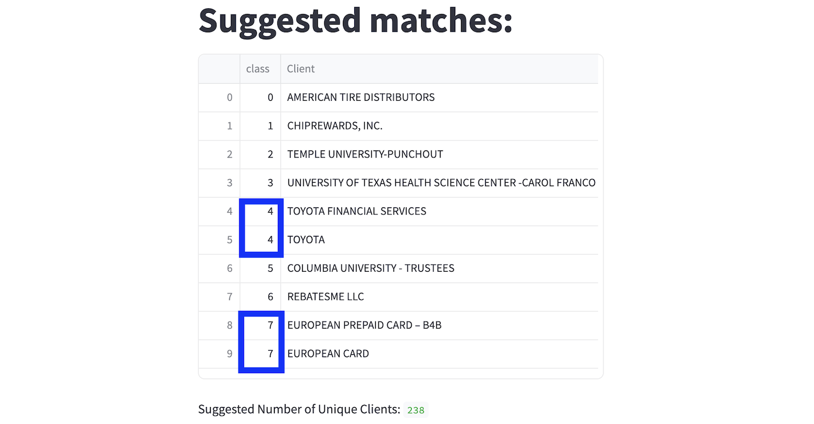

# NLP Fuzzy Matching Model

### Project Goal:
Every month, my company recieved a dataset consisting of a list of companies and their forecasted sales. The issue with the dataset was that some company names were duplicated with slightly different titles. This required at least two hours of manually cleaning the data each month. To automate this process, I built an NLP fuzzy matching tool that reconciled these titles and matched them programmatically, saving the company from the hassle of hand labeling the data.

### Technologies:
- Python (scikit-learn, pandas, numpy)
- TF-IDF Vectorizer
- Streamlit

###
`streamlit run app.py`

